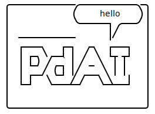

<!--  -->

                                    .--------------.------------.-.
                                    |             (              )|
                                    |              `------+ ,---' |
                                    |  ____________       |/      |
                                    |   ____     _    _   '___    |
                                    |  |  _ \ __| |  / \  |_ _|   |
                                    |  | |_) / _` | / _ \  | |    |
                                    |  |  __/ (_| |/ ___ \ | |    |
                                    |  |_|   \____/_/   \_\___|   |
                                    |                             |
                                    |                             |
                                    '-----------------------------'

## Chat with your Data

Chat application were users can upload a PDF and get an AI assistant relay context about the data in the PDF

## Built With

- [NextJS](https://nextjs.org/)
- [Clerk Auth](https://clerk.com/)
- [Stripe](https://stripe.com)
- [OpenAI](openai.com)
- [AWS S3](https://aws.amazon.com/)
- [Pinecone](https://www.pinecone.io/)
- [Neon DB](https://neon.tech/)

Based on this awesome tutorial, check it out - https://www.youtube.com/watch?v=bZFedu-0emE

## Get Started

Create a `.env` and get the nessasary keys

```bash
cat .env.sample > .env
```

Run the development server:

```bash
npm run dev
```

Check out screenshots [here!](./images/)
